#YALField

Custom Field component with validation for easier form-like ui creation from interface builder.
[](https://yalantis.com/?utm_source=github)

[](http://cocoapods.org/pods/YALField)
[](http://cocoapods.org/pods/YALField)
[](http://cocoapods.org/pods/YALField)

[]()
[]()
[]()
[]()
[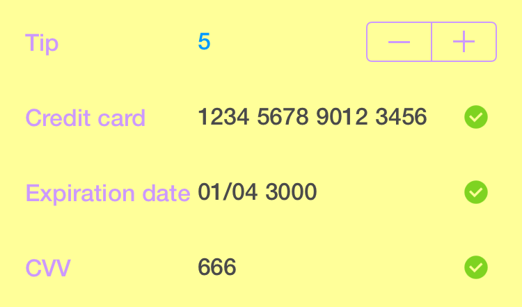]()
[]()
[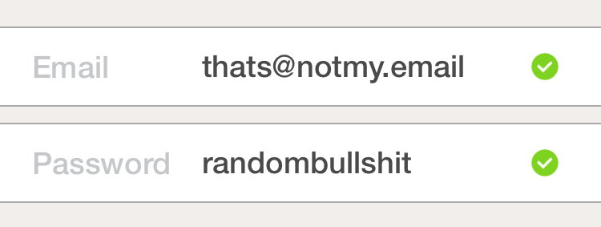]()

##Example Project
To run the example project, run `pod try YALField`.

##Usage
To successfully use `YALField` component you should take the following steps per each form you have:

1. Make subclass of `YALBaseForm` which lists fields you will have in your form like `@property (nonatomic, weak) IBOutlet YALField *fieldName;`.
2. Make a subclass of `YALField` and update it as you want. For example make also a subclass of `configurator` and set it to the `YALField` in `commonInit`
3. Go make a view controller, add your `fields` on the `view`, add some `constraints` configure `properties` as you want and drop a `form` as object onto scene at the same level as `Exit` and `First Responder` objects. Also don't forget to add `finishButton` of type `UIButton` somewhere on the `view`.
[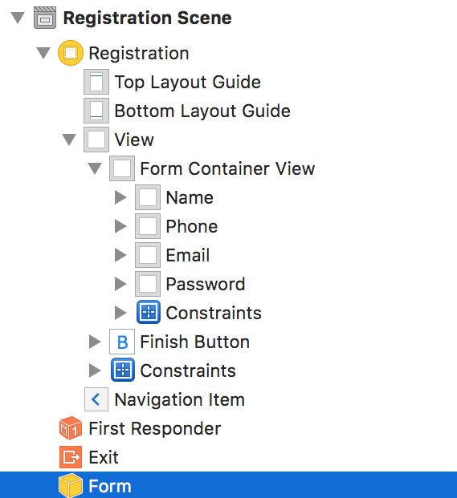]()

4. Add `validators`, `formatters` and `supplementaryViews` on the same level in scene as `form`.
[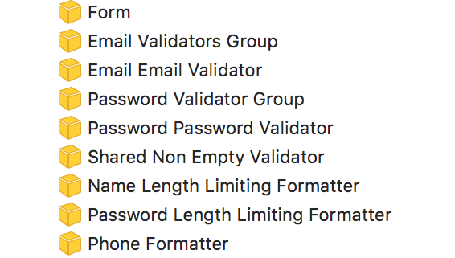]()
5. Wire `IBOutlets` of every `field` with it's `validator`, `formatter` and `supplementaryView`. You can wire `validator` and `formatter` to as many `fields` as you want **but remember** you can not use one `supplementaryView` for more than one `field`.
[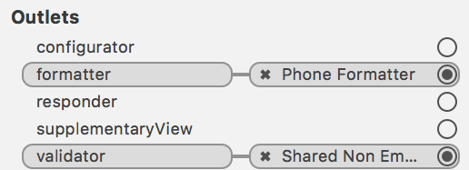]()

6. Go conform `YALFormFinishResponder` and `YALErrorsPresenter` to your `viewController` and implement needed methods.
7. Then wire `IBOutlets` of `form` with `fields`, `errorPresenter`, `finishResponder` and `finishButton`.
[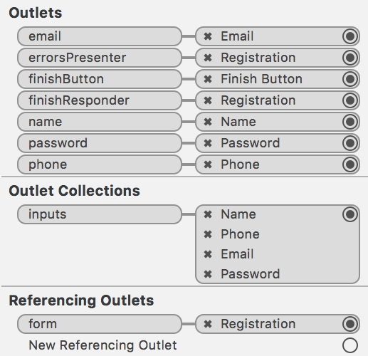]()

8. **Done!**


##Requirements
iOS 8 or higher.

##Installation

####[CocoaPods](http://cocoapods.org)

``` ruby
pod 'YALField', '~> 1.0.1'
```

####Manual Installation

Alternatively, you can directly add all the source files from YALField to your project.

1. Download the [latest code version](https://github.com/Yalantis/YALField/archive/master.zip) or add the repository as a git submodule to your git-tracked project.
2. Open your project in Xcode, then drag and drop all folder directories in Pod/ onto your project (use the "Product Navigator view"). Make sure to select Copy items when asked if you extracted the code archive outside of your project.
3. Make concrete subclasses of YALField and YALBaseForm or use them directly from interface builder and import wherever you need it with `#import "YALField.h"` and `#import "YALBaseForm.h"` or import your concrete subclasses.

##Introduction

The main two classes you need to know about is `YALField` and `YALBaseForm`.
`YALField` is a the main ui component represents a single field of form. It conforms to protocols `YALInput` and `YALConstraintBasedUIComponent` publicly and `UITextFieldDelegate` and `YALFieldInput` privately.
`YALBaseForm` is the model made for representing the form, and containing and managing fields of concrete form. `YALBaseForm` should be subclassed to have concrete models of forms like `YALLoginForm` or `YALRegistrationForm` for example which carry concrete form fields. `YALBaseForm` conforms to `YALForm` protocol.

###YALField
####Examples
[]()
[]()
[]()
[]()
[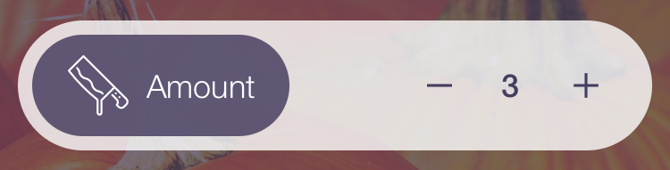]()

####Scheme
`YALField` is designed to consist of three parts (from left to right):

1. `titleView` of class `UILabel` (cyan)
2. `textField` of class `UITextField` (yellow)
3. `supplementaryView` which must be a subclass of `YALBaseSupplementaryView` (magenta)

[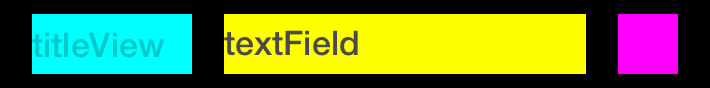]()

####Guts
`YALField` has a number of properties which define how it looks:

1. `IBOutlet id<YALInputConfigurator> configurator`
2. `IBOutlet UIView *supplementaryView`

and how it works:

1. `IBOutlet id<YALResponder> responder`
2. `IBOutlet id<YALValidator> validator`
3. `IBOutlet id<YALFormatter> formatter`

[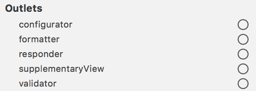]()

####Look
######`configurator`
`configurator` define how `YALField` looks. You can subclass `YALFieldConfigurator` and set it's properties in `init` and/or override following methods: `configureView`, `configureView:forState`, `resetView`. Or you may use one directly from interface builder and modify it's properties there. One `configurator` may be used with multiple `YALField's`.

[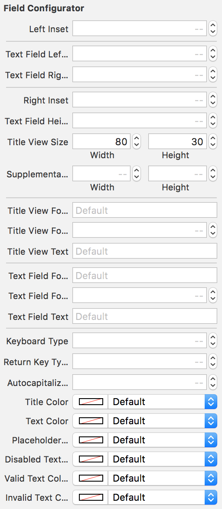]()


######`supplementaryView`
`supplementaryView` is used as view to be added inside the `YALField` and used as `supplementaryView`. Any view subclassed from `YALBaseSupplementaryView` can be used as `supplementaryView` of `YALField`.
`supplementaryView` unlike `configurator` can not be shared between multiple `YALField's`. Also `supplementaryView` should not have `superview` or in other words be someones `subview` until or after it's set to `supplementaryView` property of `YALField` cause in that moment it will be immediately added as `subview` to `YALField` and if you add it to any other view, well that breaks some things.
`YALField` pod provides two basic `supplementaryView's`: one is used internally and is `YALPasswordSupplementaryView` and another one is `YALValidatingSupplementaryView` which is made to present validating functionality in `supplementaryView`.
`YALValidatingSupplementaryView` conforms to protocol `YALStateVaryingSupplementaryView` which means it can receive `setFieldState` method and change itself whenever `fieldState` of `YALField` changes.
In the example project you may see `YALStepperSupplementaryView` which wraps `UIStepper` and which is not only `supplementaryView` of `YALField` but also `responder` which means it handles touches recieved by `YALField` and also this concrete `supplementaryView` has `field` IBOutlet which must be linked to `YALField` that owns it so that `supplementaryView` may change the `formattedValue` of `YALField`.
The second `supplementaryView` in example project is `YALHalloweenSupplementaryView` which is subclass of `YALValidatingSupplementaryView` with a slight change of pictures and pictures tint colors for different `YALFieldStates`.

####Work
######`formatter`
`formatter` is used to format `YALField` value while being input from keyboard or when set from outside with `rawValue` setter, also `formatter` converts `rawValue` to `formattedValue` when `formattedValue` getter invoked. `formatter` must conform to `YALFormatter` protocol. One `formatter` may be used with many `YALFields`.
We provide only one formatter in pod - `YALLengthLimitingFormatter` which can be easily used or taken as example when developing `formatter` by yourself. Formatters in Example project considered to much of a copy paste or to simple and unique case to be included in pod.

######`validator`
`validator` should be subclass of `YALBaseValidator`. `validator` is used to validate the `YALField` it conforms to protocol `YALValidator` which has only one method `- (BOOL)isValid:(id<YALInput>)input error:(out NSError **)error;`.
`validator` has a property named `errorsProviderClassName` which if needed should be the class name of class which should conform to protocol `YALErrorsProvider` and can be subclassed from `YALBaseErrorsProvider`. This class should provide `NSError` for `validator` `+ (NSError *)errorForValidator:(id<YALValidator>)validator`, most of this logic is encapsulated in `YALBaseValidator` which means that in subclass you can just provide this class name and use `- (NSError *)error` to get error for `validator`.
In pod we provide few basic validators to base your own on:

1. `YALBaseValidator` is `validator` to make your own custom `validators` from it.
2. `YALGroupValidator` provides functionality to group and order multiple `validators` in itself to use multiple `validators` on one `YALField`.
3. `YALNonEmptyValidator` takes `rawValue` of `YALField` as `NSString` and checks if it's not empty.
4. `YALRegexValidator` takes Regular Expression in `regex` `IBInspectable` property and checks if `rawValue` of `YALField` matches `regex`.

######`responder`
`responder` is the object which conforms to protocol `YALResponder` and may take care of touches received by `YALField` by implementing methods like `performAction:` or `becomeFirstResponder`.
In example project `YALStepperSupplementaryView` is `responder` of `YALField` to prevent `YALField` from user interaction. Another example in example project is `birthDateResponder` in `YALEditProfileViewController` which presents `datePicker` when we touch `YALField` `birthDate`.

###YALBaseForm
`YALBaseForm` is a base class for you to subclass your forms from it as for example done `YALRegistrationForm` in Example project:
```objective-c
#import "YALBaseForm.h"

@class YALField;

@interface YALRegistrationForm : YALBaseForm

@property (nonatomic, weak) IBOutlet YALField *name;
@property (nonatomic, weak) IBOutlet YALField *phone;
@property (nonatomic, weak) IBOutlet YALField *email;
@property (nonatomic, weak) IBOutlet YALField *password;

@end
```
Later this form model should be wired with it's fields:
[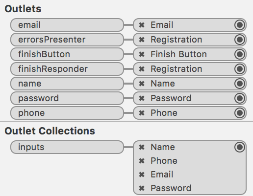]()
Also you may notice here three not mentionet previously `IBOutlets` of `YALBaseForm`:

1. `errorsPresenter` is an object conforming to `YALErrorsPresenter` protocol which obviously will present any `NSErrors` recieved from form, in this concrete case it's `YALRegistrationViewController` superclass `YALBaseViewController`.
2. `finishResponder` is an object that conforms to `YALResponder` protocol and expected to respond to `performAction:` selector. `performAction:` will be invoked when the next interesting object  `finishButton` catches `UIControlEventTouchUpInside` event. Also `finishResponder` can conform to `YALFormFinishResponder` protocol which means it has a property `form` of type `YALBaseForm` and it will be set if it not yet have been set when form finished.
3. `finishButton` is expected to be instance of `UIButton`. When both `finishButton` and `finishResponder` set `YALBaseForm` adds target `self` to `finishButton` to catch event when `finisButton` will be touched up inside so that form may invoke `performAction:` on `finishResponder` sending `self` as `sender`.

So in case with `YALRegistrationViewController` which is `finishResponder` of `YALRegistrationForm` you just catch form finish event if and only if every field in form that has a `validator` `isValid` like this:
```objective-c

@implementation YALRegistrationViewController

...

- (void)performAction:(YALRegistrationForm *)form {
    // collect data from form and perform real request to your API for example
    [self pretendToDoSomeNetworkRequestWithWithTitle:@"Registrering" completion:^{
        [self performSegueWithIdentifier:@"RegistrationToLogin" sender:self];
    }];
}

@end
```

##Author

Igor Muzyka, igor.muzyka@yalantis.com

##License

The MIT License (MIT)

Copyright © 2015 Yalantis

Permission is hereby granted, free of charge, to any person obtaining a copy
of this software and associated documentation files (the "Software"), to deal
in the Software without restriction, including without limitation the rights
to use, copy, modify, merge, publish, distribute, sublicense, and/or sell
copies of the Software, and to permit persons to whom the Software is
furnished to do so, subject to the following conditions:

The above copyright notice and this permission notice shall be included in
all copies or substantial portions of the Software.

THE SOFTWARE IS PROVIDED "AS IS", WITHOUT WARRANTY OF ANY KIND, EXPRESS OR
IMPLIED, INCLUDING BUT NOT LIMITED TO THE WARRANTIES OF MERCHANTABILITY,
FITNESS FOR A PARTICULAR PURPOSE AND NONINFRINGEMENT. IN NO EVENT SHALL THE
AUTHORS OR COPYRIGHT HOLDERS BE LIABLE FOR ANY CLAIM, DAMAGES OR OTHER
LIABILITY, WHETHER IN AN ACTION OF CONTRACT, TORT OR OTHERWISE, ARISING FROM,
OUT OF OR IN CONNECTION WITH THE SOFTWARE OR THE USE OR OTHER DEALINGS IN
THE SOFTWARE.
